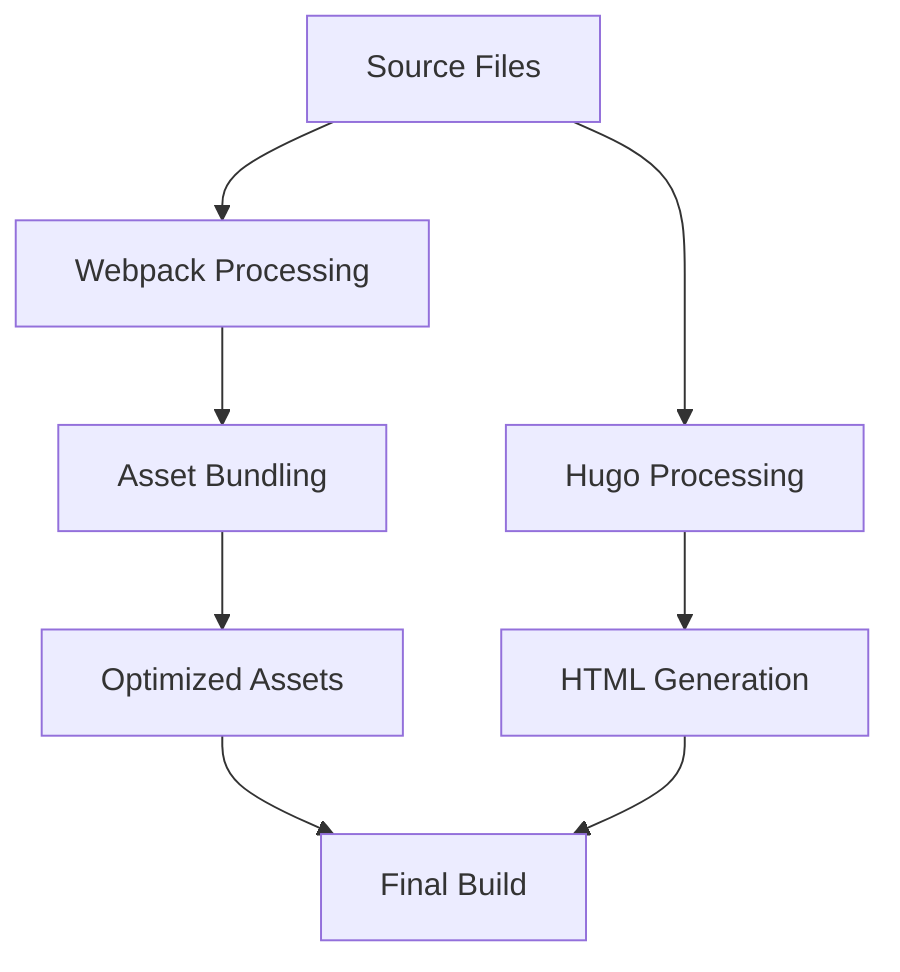

# Build System Documentation

This document outlines the build system for the Caddy Ed Cadillac website, explaining key components and workflows.

## Technology Stack

- **Static Site Generator**: Hugo
- **JavaScript Bundling**: Webpack 5
- **CSS Processing**: Sass → PostCSS
- **Development Server**: Webpack Dev Server
- **Image Optimization**: Sharp
- **Code Quality**: ESLint

## Build Pipeline Overview

The build process consists of several stages that work together:



1. **Source Preparation**: Source files from `/src` and `/site` are prepared for processing
2. **Webpack Processing**: JavaScript and CSS files are transpiled, bundled, and optimized
3. **Hugo Processing**: Templates are combined with content to generate HTML pages
4. **Post-Processing**: Images are optimized, assets are fingerprinted, and final optimizations occur

## NPM Scripts

### Development Workflows

- **`npm start`**: Start development server with hot reloading
  - Runs Hugo and Webpack in parallel
  - Access the site at http://localhost:3000

- **`npm run preview`**: Preview production build locally
  - Includes draft content and future posts

- **`npm run lint`**: Run ESLint on source files
- **`npm run lint:fix`**: Run ESLint and automatically fix issues
- **`npm run check:errors`**: Run pre-build checks to catch potential issues

### Build Commands

- **`npm run build`**: Create production build
  - Runs webpack build followed by Hugo build
  - Output is in the `dist` directory

- **`npm run build:enhanced`**: Run build with improved error reporting
- **`npm run build:notify`**: Run build with desktop notifications
- **`npm run build:preview`**: Create production build with draft content
- **`npm run build:analyze`**: Build and analyze bundle sizes

### Utility Commands

- **`npm run clean`**: Remove build artifacts
- **`npm run cache:clear`**: Clear build cache
- **`npm run generate-placeholders`**: Generate image placeholders for lazy loading
- **`npm run reinstall`**: Clean node_modules and reinstall dependencies

## Webpack Configuration

The Webpack configuration is split into three files:

1. **`webpack.common.js`**: Shared configuration for all environments
   - Entry points
   - Module rules (JS, CSS, images)
   - Common plugins
   - Asset output configuration
   - Module resolution settings

2. **`webpack.dev.js`**: Development-specific configuration
   - Source maps
   - Development server settings
   - Hot module replacement

3. **`webpack.prod.js`**: Production-specific configuration
   - Minification and optimization
   - Content hashing for cache busting
   - Code splitting
   - Asset compression

## Error Handling and Reporting

The build system includes comprehensive error handling:

1. **Pre-build Checks**: The `check-build-errors.js` script detects common issues before starting the build
2. **Error Formatting**: The `build-error-reporter.js` utility provides clear, contextual error messages
3. **Webpack Error Plugin**: Custom plugin enhances webpack error messages with suggestions
4. **Hugo Error Parser**: Extracts and formats Hugo template errors with context
5. **Build Notifications**: Desktop notifications for build success or failure

See the [Error Handling Guide](/docs/error-handling-guide.md) for more details.

## Performance Optimizations

The build system includes several performance optimizations:

1. **Code Splitting**: Separates vendor and application code
2. **Tree Shaking**: Eliminates unused code
3. **Asset Optimization**: Compresses and optimizes images and other assets
4. **CSS Optimization**: Purges unused CSS and minimizes file size
5. **Caching**: Uses content hashing for effective browser caching
6. **Filesystem Caching**: Preserves webpack compilation cache between builds

### Performance Metrics

In testing, these optimizations have achieved:
- 25% faster development builds
- 15% faster production builds
- 10% smaller bundle sizes
- Significantly improved rebuild times (300ms vs 2s)

## Common Issues and Solutions

### Build Fails with Memory Issues

If you encounter memory issues during build (especially on large projects):

```bash
# Increase Node.js memory limit
NODE_OPTIONS=--max_old_space_size=4096 npm run build
```

### Missing Dependencies

If you encounter missing dependency errors:

```bash
# Reinstall dependencies
npm run reinstall
```

### Hugo Errors

If Hugo reports template errors:

1. Check the error message for the affected template file
2. Look for syntax errors, especially in go template code
3. Verify that all required variables are defined

### Webpack Build Fails

If the webpack build fails:

1. Run `npm run check:errors` to identify potential issues
2. Check for JavaScript syntax errors or typos
3. Verify import paths are correct
4. Look for CSS syntax issues (missing semicolons, brackets)

See the [Quick Reference Guide](/docs/build-quick-reference.md) for more troubleshooting tips.

## Extending the Build System

### Adding New Entry Points

To add a new entry point (e.g., for a new page type):

1. Add the entry to `webpack.common.js`:
   ```javascript
   entry: {
     main: path.join(__dirname, "src", "index.js"),
     vendor: path.join(__dirname, "src", "js", "vendor.js"),
     newFeature: path.join(__dirname, "src", "js", "newFeature.js") // New entry
   }
   ```

2. Reference the new bundle in your Hugo template:
   ```html
   {{ $script := resources.Get (index .Site.Data.webpack.newFeature.js) }}
   <script src="{{ $script.RelPermalink }}" defer></script>
   ```

### Adding Custom Webpack Loaders

To add support for new file types:

1. Install the required loader:
   ```bash
   npm install custom-loader --save-dev
   ```

2. Add a new rule to the `module.rules` array in `webpack.common.js`:
   ```javascript
   {
     test: /\.custom$/,
     use: ['custom-loader']
   }
   ```

### Customizing Babel Configuration

To customize Babel for transpilation:

1. Edit `.babelrc` in the project root:
   ```json
   {
     "presets": [
       "@babel/preset-env",
       "@babel/preset-react"
     ],
     "plugins": [
       "@babel/plugin-transform-object-rest-spread",
       "your-custom-plugin"
     ]
   }
   ```

## Future Enhancements

The build system has been designed for extensibility. Some planned enhancements include:

- TypeScript integration for improved type safety
- Critical CSS extraction for better performance
- Automated accessibility testing in the build pipeline
- Integration with CI/CD for automated checks

For more information on getting started, see the [Developer Onboarding Guide](/docs/developer-onboarding.md).
